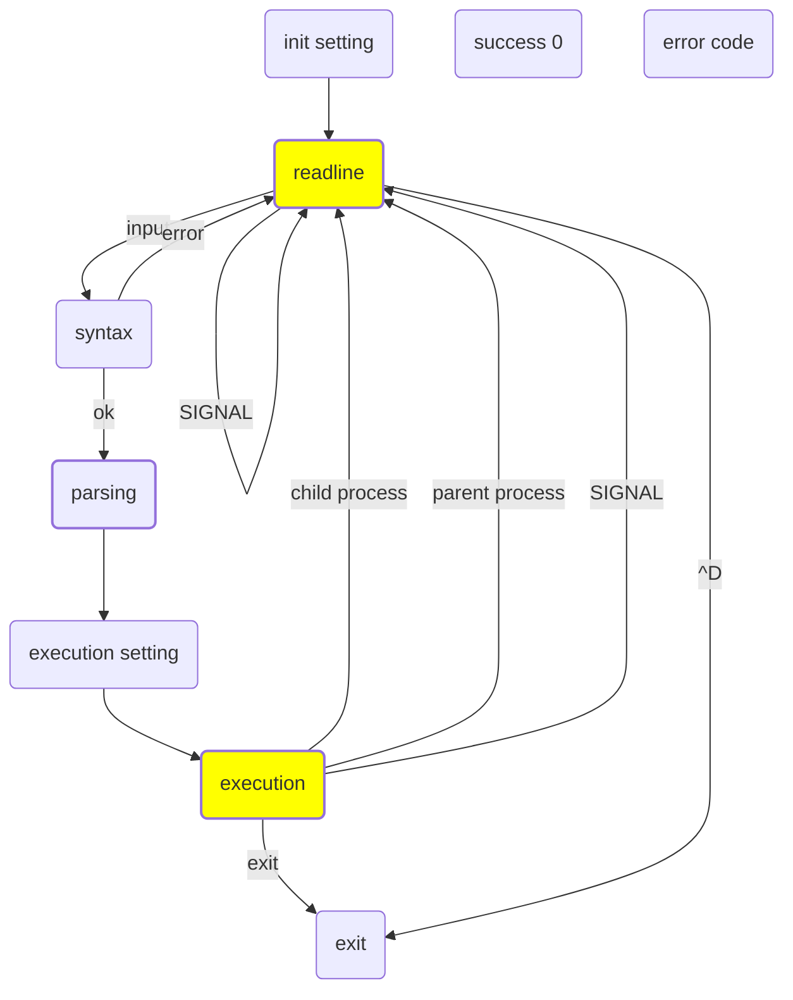

## Overview

## 구현 사항
- history 기능 화살표 키를 사용하여 이전 명령어를 불러올 수 있음.
- PATH를 사용해서 절대 경로 및 상대 경로로 프로그램 실행
- < > << >> 파일 리다이렉션 구현
- | (pipe) 구현 이전 명령어의 출력을 다음 명령어의 입력으로 연결
- $를 사용해서 환경변수 참조 가능
- ^C(SIGINT), ^\(SIGQUIT) 쉘이 종료되지 않고 foreground 프로세스 종료 기능
- builtin 커맨드 구현
  - echo, cd, pwd, export, unset, env, exit
    
